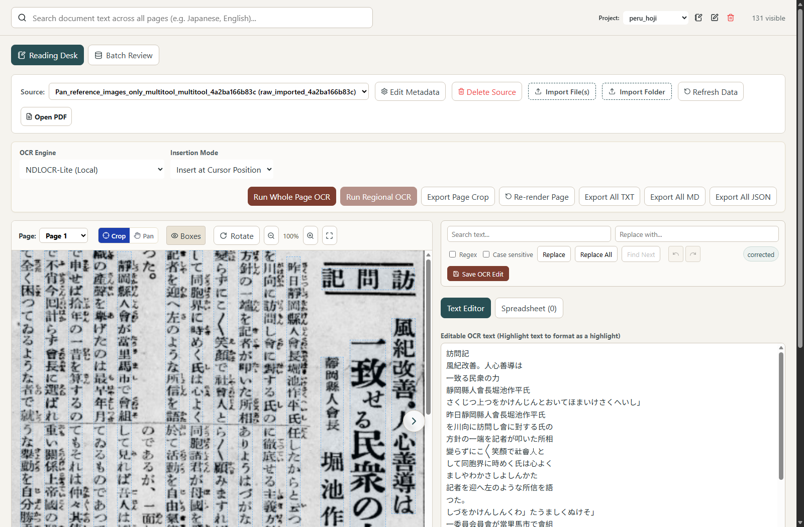
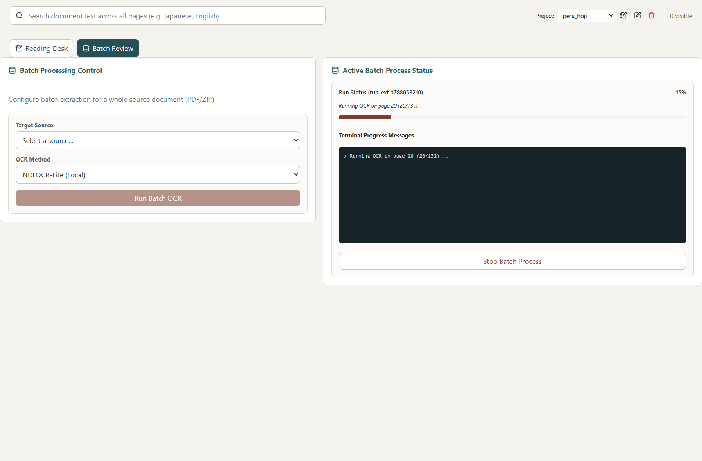

# 📖 Standalone OCR & Reading Desk

A local-first, privacy-focused OCR, document proofreading, and transcription workbench designed for historical documents, scanned books, newspapers, and archival materials.

It operates entirely locally on your computer without requiring complex database setups or mandatory internet connectivity for core workflows.

---

## 📸 Screenshots

### 1. Interactive Reading Desk
Side-by-side view of original scanned pages and editable transcriptions, complete with bounding box overlays, line sync, region cropping, and live find-and-replace:



### 2. Batch Document OCR Processing
Automated multi-page document OCR queue with real-time progress tracking:



---

## ✨ Key Features

- **Side-by-Side Reading Desk**: Inspect original scanned PDF pages or images directly alongside editable transcriptions.
- **OCR Bounding Box Synchronization**: View OCR bounding boxes overlaid onto the scanned image. Clicking any box immediately highlights and navigates to the corresponding line in the text editor.
- **Precision Crop & Regional OCR**: Click and drag to select any column, headline, passage, or table. Export selections directly as image files or trigger regional OCR on specific sections.
- **Local & Offline by Default**: Powered by **NDL-OCR (NDLOCR-Lite)** developed by Japan's National Diet Library. Works 100% offline with zero subscription fees.
- **Optional Cloud Vision AI**: Easily connect Google Gemini, OpenAI GPT-4o, or Anthropic Claude for alternative recognition passes or complex document layouts.
- **Browser Drag-and-Drop Import**: Drag PDFs, single images, or multi-image sets (`.pdf`, `.png`, `.jpg`, `.tiff`, `.webp`) directly into your browser window to import them instantly.
- **Full Proofreading Toolkit**: Integrated regex search & replace, undo/redo history, highlight tagging, and one-click transcription saving.
- **Batch Processing**: Run automated multi-page OCR across entire documents with real-time progress indicators.
- **Multi-Format Export**: Export verified transcriptions as plain text (`.txt`), formatted Markdown (`.md`), or structured JSON (`.json`).

---

## 🚀 Quick Start Guide

### Option 1: Standalone Download (Recommended for Most Users)
> **No Python, Node.js, or terminal commands required!** Everything (the local NDL-OCR engine, runtime, and web interface) is fully self-contained in the release package.

1. Go to the [**Latest GitHub Release (v1.0.5)**](https://github.com/azurebamboo/koshu-reading-workbench/releases/latest).
2. Download the zip file for your system:
   - **Windows**: [`koshu-workbench-windows.zip`](https://github.com/azurebamboo/koshu-reading-workbench/releases/latest/download/koshu-workbench-windows.zip)
   - **macOS**: [`koshu-workbench-macos.zip`](https://github.com/azurebamboo/koshu-reading-workbench/releases/latest/download/koshu-workbench-macos.zip)
3. Extract (unzip) the folder anywhere on your computer.
4. Launch the application:
   - **Windows**: Double-click **`start.bat`**
   - **macOS**: Double-click **`start.command`**
5. Your browser will automatically open to `http://localhost:8000/`. You are ready to start reading and proofreading!

---

### Option 2: Run from Source (For Developers & Power Users)
If you prefer to clone the Git repository and run directly from source:

1. **Prerequisites**:
   - **Python**: Version 3.10 or higher ([Download Python](https://www.python.org/downloads/))
   - **Node.js**: Version 18 or higher ([Download Node.js](https://nodejs.org/))

2. **One-Click Setup**:
   In your terminal inside the cloned project directory, run:
   ```bash
   python install.py
   ```
   > **What this does**: Automatically sets up the Python virtual environment, installs backend dependencies, installs frontend packages, and compiles the single-file web application bundle.

3. **Launch the Application**:
   - Double-click **`start.bat`** (Windows) / **`start.command`** (macOS), or run:
     ```bash
     python scripts/skill_launcher.py start
     ```

---

## 💡 How to Use the Reading Desk

1. **Import Documents**:
   - Click **Import File(s)** in the toolbar or simply drag and drop your PDF or image files anywhere onto the window.
2. **Select & Inspect**:
   - Choose your document and page from the top dropdown menus.
   - Click the **Boxes** button to toggle OCR bounding boxes on and off.
   - Click any bounding box on the image to locate and highlight that text in the editor.
3. **Crop & Regional OCR**:
   - Select **Crop** mode in the toolbar.
   - Drag a box over any passage, article, or table.
   - Click **Run Regional OCR** to extract text from that specific area, or **Export Page Crop** to download it as an image.
   - To clear a selection, click the **Clear Selection** button, press <kbd>Esc</kbd>, or click anywhere on the page.
4. **Proofread & Save**:
   - Edit and correct the transcription in the right-hand text editor.
   - Click **Save OCR Edit** (or press <kbd>Ctrl</kbd>+<kbd>S</kbd>) to save your corrected text.
5. **Export Your Work**:
   - Use **Export All TXT**, **Export All MD**, or **Export All JSON** to export clean transcripts of the entire document.

---

## 🌐 Optional: Cloud AI Vision OCR

If you want to use cloud vision models (e.g. Gemini, GPT-4o, or Claude):

1. Copy `.env.example` in the root folder to `.env`:
   ```bash
   cp .env.example .env
   ```
2. Open `.env` in any text editor and insert your API key(s):
   ```ini
   GEMINI_API_KEY=your_gemini_api_key_here
   OPENAI_API_KEY=your_openai_api_key_here
   ANTHROPIC_API_KEY=your_anthropic_api_key_here
   ```
3. Restart the application. The cloud models will automatically appear in the **OCR Engine** dropdown.

---

## 🛠️ Developer Mode

If you are developing or modifying the React frontend with hot-module reloading (HMR):

```bash
python scripts/skill_launcher.py start --dev
```

This boots the FastAPI backend on port `8000` and the Vite development server on port `5173`.

---

## 🙏 Special Thanks & Acknowledgements

This application relies on and extends the remarkable open-source work of:

- **[NDL-OCR / NDLOCR-Lite](https://github.com/ndl-lab/ndlocr-lite)**:
  Special thanks and deep gratitude to the **National Diet Library (NDL) Lab (国立国会図書館)** for developing and open-sourcing **NDL-OCR** and **NDLOCR-Lite**. Their specialized machine learning models for Japanese historical text, vertical typography, and archival documents power the core offline OCR capabilities of this workbench.
- **[Lucide Icons](https://lucide.dev/)**: For the clean UI icon library.
- **[FastAPI](https://fastapi.tiangolo.com/)** & **[Vite](https://vitejs.dev/)**: For the robust backend and modern frontend tooling.


